<div align="center">


<br/>


&nbsp;

&nbsp;

&nbsp;

&nbsp;


</div>

---

## 📌 What Is This?

**GMB Reviews → Google Sheet** is a fully automated Make.com pipeline for **Back in Motion Physical Therapy & Performance**. It pulls all Google My Business reviews for a specific provider location, intelligently upserts them into a master `Google Reviews` tracking sheet, and then cascades new reviews into a set of **weekly and monthly metric sheets** — all without any human touch.

When a new patient review is posted on Google, this system catches it, logs the full review record, parses the reviewer's name and review date into time segments, and updates the provider's running performance scorecards automatically.

> No manual copy-paste of reviews. No forgotten metrics. Every Google review is captured, logged, and counted — the moment it appears.

---

## 🧭 System Overview — 3 Route Architecture

| Stage | Module | Role |
|:---|:---|:---|
| **1. Fetch Location** | Google My Business | Resolve the live location object for Dr. Sharon Sims |
| **2. Fetch Reviews** | HTTP OAuth2 (GMB API v4) | Pull all reviews from the resolved location ID |
| **3. Parse & Iterate** | JSON Parser + Basic Feeder | Decode JSON, emit one review bundle at a time |
| **4. Dedup Check** | Google Sheets Filter Rows | Check if `Review ID` already exists in master sheet |
| **5. Route** | Basic Router | → **Update** existing row OR → **Add** new row |
| **6a. Update Row** | Google Sheets Update Row | Overwrite existing review data (e.g., edited reviews) |
| **6b. Add Row + Enrich** | Add Row → Set Variables → Router | Log new review, parse name/date, update metric sheets |

---

## 📸 Workflow Dashboard

<details open>
<summary><strong>👉 All Reviews → Google Sheet Engine</strong></summary>

<br>

<!-- ============================================== -->
<!-- 💡 DRAG AND DROP YOUR WORKFLOW IMAGE HERE 👇 -->
<!-- ============================================== -->


<!-- ============================================== -->

<br>

</details>

---

## ⚡ Full System Architecture

<div align="center">


</div>

---

## 🔗 Node-by-Node Breakdown

### 1️⃣ Get a Location (Google My Business)

Resolves the live location object for the target provider from the GMB account. The `name` field from this response (e.g., `locations/3008672122189447743`) is then injected dynamically into the next API request URL.

```
Configuration:
    Account   : Back in Motion Physical Therapy & Performance
                (accounts/107919968580486048680)
    Location  : Dr. Sharon Sims - Doctor of Physical Therapy
                12230 River Village Way, Fort Myers, FL 33905
    Output    : {{50.name}}  ← used in next HTTP URL
```

---

### 2️⃣ Fetch Reviews (HTTP OAuth2 — GMB API v4)

Hits the Google My Business API directly via an authenticated HTTP GET request. This is necessary because Make's native GMB module does not expose a "list reviews" endpoint, so a raw HTTP call is required.

```
Method    : GET
URL       : https://mybusiness.googleapis.com/v4/
            accounts/107919968580486048680/{{50.name}}/reviews
Auth      : OAuth2 (new OAuth 2.0 connection)
Response  : Raw JSON body (parseResponse: false → handled in next step)
```

> **Why raw HTTP and not the native module?** The native `google-my-business` module in Make does not include a "get reviews" action. Using a direct HTTP OAuth2 request against the GMB API v4 is the only way to pull the reviews list programmatically.

---

### 3️⃣ Parse JSON

Decodes the raw HTTP response body (`{{46.data}}`) into a structured Make bundle, producing a usable `reviews` array.

```
Input  : {{46.data}}  ← raw body from HTTP step
Output : reviews[]    ← array of individual review objects
```

---

### 4️⃣ Basic Feeder (Iterator)

Receives the full `reviews[]` array and emits **one review bundle per cycle**, allowing all downstream modules to process each review independently.

```
Input  : {{47.reviews}}
Output : One review object per cycle:
    reviewId
    reviewer.displayName
    starRating
    comment
    createTime
    updateTime
```

---

### 5️⃣ Filter Rows — Google Reviews Sheet (Dedup Check)

Before writing anything, this step checks if the `reviewId` already exists in the master `Google Reviews` tab. It returns the full row if found, including the row number — critical for the update path.

```
Spreadsheet  : 2025 Weekly Metrics (11c4zB5EUocoFz1nGhJ3gxaWeyxeCQPgrxKThGjnt4sk)
Sheet Tab    : Google Reviews
Filter       : Column A = {{48.reviewId}}
Output       :
    __IMTLENGTH__    → total matching rows (0 = new, 1+ = exists)
    __ROW_NUMBER__   → row to update (if exists)
    Column 0 (A)     → Review ID
    Column 1 (B)     → Display Name
    ... (up to CZ)
```

---

### 6️⃣ Basic Router — Upsert Decision

The router gates the two write paths based on the dedup check result:

```
Route 1 — UPDATE (all must pass):
    ✅  {{11.__IMTLENGTH__}}  ≠  0          (row exists in sheet)
    ✅  {{48.reviewId}}  =  {{11.`0`}}      (IDs match exactly)

Route 2 — ADD NEW:
    ✅  {{48.reviewId}}  ≠  {{11.`0`}}      (no match = new review)
```

---

### 🔄 Route 1 — Update Existing Row

Overwrites the existing row at the exact row number returned by the filter, keeping all 7 columns accurate (handles edited/updated reviews).

```
Target Row   : {{11.__ROW_NUMBER__}}
Spreadsheet  : 2025 Weekly Metrics
Sheet Tab    : Google Reviews
Values Written:
    A  : {{48.reviewId}}
    B  : {{48.reviewer.displayName}}
    C  : {{48.starRating}}
    D  : {{48.comment}}
    E  : {{formatDate(48.createTime; "DD.MM.YYYY")}}
    F  : "Dr. Sharon Sims"            ← hardcoded provider
    G  : "Cape Coral"                 ← hardcoded location
```

---

### ➕ Route 2 — Add New Row + Enrich

Only fires for reviews not yet in the sheet. Adds the full row, then enriches with parsed name/time variables for metric routing.

#### Step 1: Add Row

```
Insert Mode  : INSERT_ROWS (pushes new row, preserves existing data)
Sheet Tab    : Google Reviews
Same 7 columns as Update path (identical field mapping)
```

#### Step 2: Set Variables

Parses the reviewer name and review date into reusable variables for metric sheet targeting:

```javascript
First name  = first(split(displayName, " "))
Last name   = last(split(displayName, " "))

week        = if day <= 7  → 1
              if day <= 15 → 2
              if day <= 23 → 3
              else         → 4

monthly     = formatDate(createTime, "MMMM")   // e.g., "August"
```

#### Step 3: Router 2 — Metric Sheet Routing

Sends the new review data to the appropriate metric tracking sheets:

```
Route A → Provider Monthly Sheet
Route B → Weekly Sheet (implied from data store week column)
```

---

### 📊 Provider Monthly Route (Route 2A)

#### Filter Provider Monthly Sheet

```
Sheet Tab   : Provider Monthly
Filter Row  : Column D = "Dr. Sharon YTD -11"
              AND Column E = "Google Reviews"
Output      : Matching row number for the provider's Google Reviews metric row
```

#### Data Store Search — Filter By Month

```
Data Store  : My data store
Filter      : month = {{14.monthly}}    ← e.g., "August"
Returns     :
    col_range    → column letter for this month's block
    week1-week5  → column offsets for each week within the month
```

> **Why a Data Store?** The metric sheet uses a complex column layout where each month occupies a specific column range, and each week within that month maps to a sub-column. The Data Store acts as a lookup table, eliminating hardcoded column logic from the scenario itself.

---

## 📊 Data Mapping Schema

### Google Reviews Sheet — Master Log

| Column | Field | Source |
|:---|:---|:---|
| A — Review ID | `reviewId` | GMB API (unique dedup key) |
| B — Display Name | `reviewer.displayName` | GMB API |
| C — Star Rating | `starRating` | GMB API |
| D — Comment | `comment` | GMB API |
| E — Create Date | `formatDate(createTime, "DD.MM.YYYY")` | GMB API (formatted) |
| F — Provider Name | `"Dr. Sharon Sims"` | Hardcoded |
| G — Location | `"Cape Coral"` | Hardcoded |

### Provider Monthly Sheet — Metric Tracker

| Column | Field |
|:---|:---|
| D | Provider identifier (`Dr. Sharon YTD -11`) |
| E | Review source (`Google Reviews`) |
| Col Range | Determined by Data Store month lookup |
| Week columns | `week1` through `week5` from Data Store |

### Make Data Store — Month/Week Mapping

| Key | Description |
|:---|:---|
| `month` | Month name (e.g., `"August"`) — lookup key |
| `col_range` | Base column letter for this month's block in the sheet |
| `week1` | Column offset for days 1–7 |
| `week2` | Column offset for days 8–15 |
| `week3` | Column offset for days 16–23 |
| `week4` | Column offset for days 24–31 |
| `week5` | Edge-case overflow column |

---

## 🔄 End-to-End Sequence

```mermaid
sequenceDiagram
    participant GMB as 📍 Google My Business
    participant HTTP as 📡 HTTP OAuth2
    participant MAKE as ⚙️ Make Engine
    participant GS as 📊 Google Sheets
    participant DS as 💾 Data Store

    MAKE->>GMB: Resolve location for Dr. Sharon Sims
    GMB-->>MAKE: Return location name (locations/...)
    MAKE->>HTTP: GET /accounts/.../reviews
    HTTP-->>MAKE: Raw JSON reviews payload
    MAKE->>MAKE: Parse JSON, feed iterator

    loop For each review
        MAKE->>GS: Filter Rows — lookup reviewId in Google Reviews tab
        GS-->>MAKE: Row data + __IMTLENGTH__

        alt Review already exists
            MAKE->>GS: Update Row at __ROW_NUMBER__
        else New review
            MAKE->>GS: Add Row to Google Reviews tab
            MAKE->>MAKE: Set Variables (name, week, month)
            MAKE->>GS: Filter Provider Monthly sheet row
            GS-->>MAKE: Return provider metric row
            MAKE->>DS: Search by month name
            DS-->>MAKE: Return col_range and week columns
            MAKE->>GS: Update monthly metric cell
            MAKE->>GS: Update weekly metric cell
        end
    end

    Note over MAKE,GS: All reviews synced
```



---

## ⚙️ Key Design Decisions

| Decision | Reason |
|:---|:---|
| Raw HTTP for review fetch | Make's native GMB module has no "list reviews" action — direct API call is the only option |
| Filter Rows before writing | Acts as a dedup gate — prevents duplicate rows accumulating on every run |
| `__IMTLENGTH__ ≠ 0` filter on update route | Ensures we only attempt an update when the filter actually found a matching row; avoids null row writes |
| `INSERT_ROWS` on Add Row | Prevents overwriting adjacent data; new reviews always push existing rows down cleanly |
| Hardcoded Provider Name + Location | These are static per scenario run — ensures consistent label matching in metric sheets even if GMB metadata changes |
| Data Store for month/week mapping | Externalizes the complex column-addressing logic; updating the column layout only requires a Data Store edit, not a scenario rebuild |
| `formatDate(createTime, "D")` for week number | Converts timestamp to day-of-month integer for clean 4-bucket week bucketing |

---

## 📈 How It Works End-to-End

```
Scenario runs (scheduled or manual)
        ↓
Resolve Dr. Sharon Sims' live GMB location ID
        ↓
Fetch all reviews via GMB API v4
        ↓
Parse JSON → iterate one review at a time
        ↓
For each review:
    Check if Review ID exists in Google Reviews sheet
        ├── EXISTS  → Update existing row (handles edited reviews)
        └── NEW     → Add new row
                        ↓
                    Parse reviewer name + date into week/month buckets
                        ↓
                    Lookup provider row in Provider Monthly sheet
                    Lookup month column range from Data Store
                        ↓
                    Increment weekly + monthly review count cells
        ↓
All reviews logged and metrics updated
```

Zero manual review logging. Zero missed metrics. Every Google review lands in the right row, the right week, and the right monthly total automatically.

---

## 🛠️ Tech Stack

<div align="center">

| Tool | Role |
|:---|:---|
|  | Scenario orchestration and conditional routing |
|  | Review data source (API v4) |
|  | Master reviews log + provider metric scorecards |
|  | Month-to-column mapping lookup table |
|  | Raw GMB API access for review listing |

</div>

---

## 🚀 Setup Guide

### Prerequisites

- [ ] Make.com account
- [ ] Google account with GMB access (`scottgray0620@gmail.com`)
- [ ] Google account with Sheets access (`info@backinmotionsspt.com`)
- [ ] Make Data Store created with schema: `month`, `col_range`, `week1`–`week5`
- [ ] "2025 Weekly Metrics" spreadsheet exists with `Google Reviews` and `Provider Monthly` tabs

### Sheet Structure Required

**`Google Reviews` tab**

| A | B | C | D | E | F | G |
|:---|:---|:---|:---|:---|:---|:---|
| Review ID | Display Name | Star Rating | Comment | Create Date | Provider Name | Location |

**`Provider Monthly` tab**

| D | E | [col_range cols] |
|:---|:---|:---|
| Provider Name | Source Label | Week 1 through Week 5 counts |

### Data Store Schema

Create a Data Store record per month:

```json
{
  "month": "August",
  "col_range": "F",
  "week1": "F",
  "week2": "G",
  "week3": "H",
  "week4": "I",
  "week5": "J"
}
```

### Activation Steps

1. **Import** the `All reviews to google sheet.json` file into Make.com
2. **Connect Credentials:**
   - Google My Business OAuth2 (`scottgray0620@gmail.com`)
   - HTTP OAuth2 (same GMB scope)
   - Google Sheets OAuth2 (`info@backinmotionsspt.com`)
3. **Link Spreadsheet ID** in all Google Sheets nodes: `11c4zB5EUocoFz1nGhJ3gxaWeyxeCQPgrxKThGjnt4sk`
4. **Link Data Store** in the `Filter By Month` step
5. **Set schedule** (recommended: run nightly or after business hours)
6. **Toggle scenario to Active** ✅

---

<div align="center">

**Built by [Awais Salamat](https://github.com/awais-34)**

[](mailto:awais1salamat@gmail.com)
&nbsp;
[](https://github.com/awais-34)

</div>


